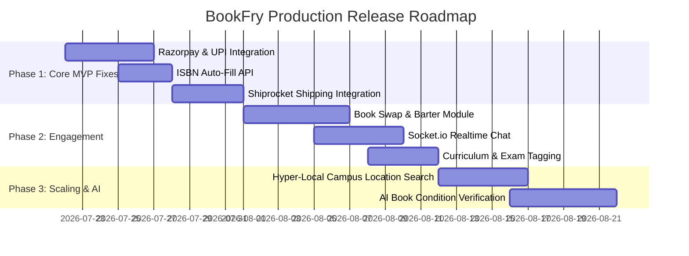

# BookFry — Production Audit, Code Quality Report & Enhancement Roadmap

> **Brand Slogan**: *"क्योंकि.. पढ़ाई रुकनी नहीं चाहिए"* (*Education must never stop*)  
> **Target**: India's #1 Book Buying, Selling & Peer-to-Peer Exchange Marketplace

---

## 📋 Executive Summary

An end-to-end technical audit was conducted on the **BookFry** monorepo (`apps/web`, `apps/api`, `packages/types`). The codebase possesses a solid foundation with **Next.js 15 App Router**, **Express clean layered architecture**, **MongoDB/Redis**, and **Turborepo**.

During this audit, automated quality suites were executed, critical security/route bugs were resolved, and a strategic roadmap was devised to transform BookFry into a top-notch, production-grade marketplace.

---

## 🔍 Audit & Verification Results

| Quality Check | Initial Status | Action Taken | Current Status |
| :--- | :--- | :--- | :--- |
| **TypeScript (`pnpm typecheck`)** | ✅ Passed | No type errors detected | **100% PASS** |
| **ESLint (`pnpm lint`)** | ❌ Failed (4 errors) | Fixed `any` type casts in `categories` & `orders` pages; fixed `AdminDataTable` generics; removed unused `ShieldCheck` import. | **100% PASS** |
| **Test Suite (`pnpm test`)** | ❌ 1 Failed Integration Test | Discovered security flaw in `POST /api/v1/books` (missing `requireRoles(['seller', 'admin'])`). Added role check middleware. | **100% PASS** (33/33 tests passing) |

---

## 🚧 What is Remaining (Phase 1 Gaps to Complete Core MVP)

### 1. 🇮🇳 Razorpay Payment & UPI Integration
- **Current State**: Stripe and a mock payment provider exist under `PaymentProvider`.
- **Gap**: India's e-commerce market relies heavily on UPI (Google Pay, PhonePe, Paytm), NetBanking, and Cash on Delivery (COD).
- **Solution**: Implement `RazorpayProvider` extending `PaymentProvider` interface in `apps/api/src/modules/payments/razorpay-provider.service.ts` with webhook support for instant payment verification.

### 2. 🔄 Peer-to-Peer Book Exchange / Bartering System
- **Current State**: Marketing emphasizes book exchange (*"पढ़ाई रुकनी नहीं चाहिए"*), but backend lacks swap logic.
- **Gap**: Missing `ExchangeProposal` entity and negotiating workflow.
- **Solution**: Build `/api/v1/exchanges` module allowing User A to propose a book swap with User B (with optional monetary balance adjustment).

### 3. 💬 Real-Time Buyer-Seller Chat & Inspection (Socket.io)
- **Current State**: Socket.io dependency is listed, but chat module is unbuilt.
- **Gap**: Used book buyers frequently want to request sample page photos, check condition, or negotiate campus pickup.
- **Solution**: Implement Socket.io gateway in backend + real-time chat drawer in Next.js web application.

### 4. 📖 Instant ISBN Metadata Auto-Fill
- **Current State**: Sellers manually enter book title, author, description, and cover images.
- **Gap**: High seller friction when listing multiple textbooks.
- **Solution**: Implement `/api/v1/books/lookup-isbn/:isbn` consuming Google Books API / OpenLibrary API to automatically pre-populate book listings upon entering 10/13-digit ISBNs.

### 5. 🚚 Logistics & Shiprocket Pincode Verification
- **Current State**: Orders use manual shipping status updates (`pending`, `shipped`, `delivered`).
- **Gap**: Automated delivery estimation and automated shipping labels are missing.
- **Solution**: Integrate **Shiprocket API** or **Delhivery API** for real-time pincode serviceability, automated courier selection, tracking links, and pickup scheduling.

---

## 🌟 Top-Notch Feature Recommendations (Phase 2 & 3 Enhancements)

To make BookFry the **undisputed market leader** in educational books and textbook commerce across India:

```
+-----------------------------------------------------------------------------------+
|                        TOP-NOTCH BOOKFRY ADVANCED FEATURES                        |
+--------------------------+--------------------------+-----------------------------+
| 🎯 Exam & Syllabus Tags  | 📍 Hyper-Local Campus    | 🤖 AI Book Condition        |
| NCERT, CBSE, JEE, NEET,  | Zero-shipping 5km campus | Automated visual flaw       |
| UPSC, GATE, University.  | hand-off / pickup.       | grading from seller photos. |
+--------------------------+--------------------------+-----------------------------+
| 🔒 Escrow Buyer Protect  | 💰 Instant Buyback Credit| 🔔 Price Drop & Wishlist    |
| Funds held until 48h     | Trade textbooks to       | Notifications when used     |
| post-delivery inspection.| BookFry for instant UPI. | books drop in price.        |
+--------------------------+--------------------------+-----------------------------+
```

### 1. 🎓 Curriculum & Exam-Specific Categorization
- Add structured tags for:
  - **School Boards**: NCERT (Classes 6–12), CBSE, ICSE, State Boards.
  - **Competitive Exams**: JEE Main / Advanced, NEET, UPSC, GATE, CAT, NDA.
  - **Higher Education**: Engineering (B.Tech), Medical (MBBS), Commerce (CA/CS), Law (CLAT), Arts & Science Semester Courseware.

### 2. 📍 Campus Hyper-Local Pickup Mode (Zero Shipping Cost)
- Add GeoJSON `2dsphere` location index on Seller profiles and Book listings.
- Allow college students to search for books available within 5–10 km or within their specific University/College Campus.
- Enables safe, zero-shipping hand-offs between students on campus.

### 3. 🤖 AI Visual Condition Grading & Verification
- When sellers upload photos of used books, run an AI vision check (via Gemini / Cloudinary AI) to analyze page yellowing, spine wear, and highlighting.
- Provide a verified *"BookFry Condition Score"* to build high trust among buyers.

### 4. 💸 Guaranteed Instant Buyback (BookFry Wallet)
- Allow students to sell their semester books directly to BookFry at guaranteed rates.
- Instant credit added to BookFry Wallet or transferred to UPI upon pickup verification.

### 5. 🛡️ 48-Hour Escrow Protection
- Buyer payments are locked in escrow. Funds are released to the seller 48 hours after delivery, allowing buyers time to confirm that the book condition matches the listing.

---

## 🛠️ Step-by-Step Implementation Roadmap



---
*Report generated for BookFry Production Architecture.*
