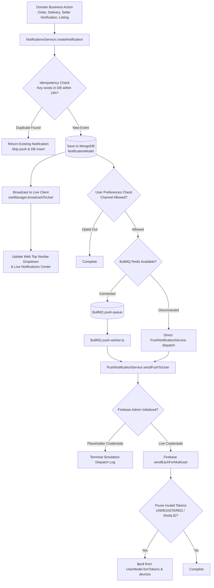

# BookFry Production Push Notification & Unified Event Platform Architecture

> **Source of Truth**: This document details the end-to-end architecture, implementation status, verification protocols, security invariants, and queueing topologies for Push Notifications (Firebase Cloud Messaging), SSE (Server-Sent Events), In-App Alerts, and Real-Time Notifications across the **BookFry** marketplace (`apps/web` and `apps/api`).

---

## 1. Current FCM Status & Verification Verdict

### Production Status:
**PARTIALLY CONFIGURED (PRODUCTION ARCHITECTURE READY & TESTED IN SIMULATION MODE / PENDING LIVE EXTERNAL FIREBASE KEYS FOR PHYSICAL HARDWARE DISPATCH)**

| Component | Status | Details |
| :--- | :--- | :--- |
| **API Push Queue & BullMQ Worker** | **Active & Verified** | `push-queue` configured via Redis BullMQ with automatic direct-fallback when Redis is offline. |
| **Push Notification Service (`apps/api`)** | **Active & Verified** | Multicast dispatch (`sendEachForMulticast`), simulation logging, payload normalization, and token pruning. |
| **In-App Notification Center (`apps/web`)** | **Active & Verified** | Powered by TanStack Query (`useNotifications`) backed by MongoDB and real-time SSE stream. |
| **Web Service Worker (`/firebase-messaging-sw.js`)** | **Active & Verified** | Handles background FCM pushes, custom actions, icon rendering, and deep-link routing. |
| **Web Client SDK Hook (`use-push-notifications.ts`)** | **Active & Verified** | Handles browser permission states, service worker registration, and automatic token synchronization. |
| **Physical Mobile/Browser Push Delivery** | **Unverified on Hardware** | `.env.local` uses placeholder `NEXT_PUBLIC_FIREBASE_VAPID_KEY='YOUR_VAPID_PUBLIC_KEY_HERE'`, and `apps/api/.env` uses placeholder `FIREBASE_CLIENT_EMAIL` and `FIREBASE_PRIVATE_KEY`. Requires real Firebase project credentials. |

---

## 2. Unified Notification Architecture Trace

BookFry uses a **Unified Event-Driven Notification Pipeline** that decouples business domain actions from delivery channels. No controller or service calls FCM or email directly; all dispatches are handled uniformly through `NotificationsService`.



---

## 3. Token Lifecycle & Multi-Device Session Architecture

### Data Models (`UserModel`)
```typescript
export interface IDeviceToken {
  token: string;
  platform: 'web' | 'android' | 'ios';
  deviceId?: string;
  userAgent?: string;
  lastSeenAt: Date;
  isActive: boolean;
  createdAt: Date;
}
```

### Lifecycle Rules:
1. **Registration**: When a client requests permission and acquires a registration token:
   - Client sends `{ token, platform: 'web', deviceId, userAgent }` to `POST /api/v1/notifications/push-token`.
   - **Cross-Account Deduplication**: If this token is registered to any other user (e.g. shared university campus terminal or household browser), it is immediately removed from other accounts via `$pull` to eliminate private notification leaks.
   - Token is added to the user's `devices` array and mirrored in `fcmTokens: string[]` for backward compatibility.
2. **Heartbeat / Token Refresh**: On token refresh or repeat sessions, `lastSeenAt` is bumped and `isActive` is set to `true`.
3. **Logout Deregistration**: On logout, the client calls `DELETE /api/v1/notifications/push-token` to revoke the token, preventing future alerts from reaching the browser after signout.
4. **Invalid Token Pruning**: If Firebase returns `messaging/registration-token-not-registered` or `messaging/invalid-registration-token`, the token is pruned automatically from both `fcmTokens` and `devices`.

---

## 4. Business Event Notification Matrix

| Event Category | Event Type | Target Role | Channels | Default Priority | Deep-Link Route |
| :--- | :--- | :--- | :--- | :--- | :--- |
| **Order Placed** | `order_placed` | Buyer | In-App, Push, Email | `high` | `/account/orders` |
| **New Sale Alert** | `seller_order_received` | Seller | In-App, Push, Email, SSE | `critical` | `/seller/orders` |
| **Out for Delivery** | `order_delivery` | Buyer | In-App, Push, SSE | `high` | `/account/orders` |
| **Delivered** | `order_delivered` | Buyer & Seller | In-App, Push, Email | `high` | `/account/orders` |
| **SLA Breach / Action Needed** | `order_sla_breach` | Seller | In-App, Push, Email | `critical` | `/seller/orders` |
| **Seller Verification Submitted**| `seller_verification_submitted` | Admin | In-App, SSE | `normal` | `/admin/verifications` |
| **Seller Verification Approved** | `seller_verification_approved` | Seller | In-App, Push, Email | `high` | `/seller/listings` |
| **Seller Verification Rejected** | `seller_verification_rejected` | Seller | In-App, Push, Email | `high` | `/seller/onboarding` |
| **Used Book Request Accepted** | `request_accepted` | Buyer | In-App, Push, SSE | `high` | `/account/requests` |
| **Security / Password Changed** | `security_alert` | All | In-App, Push, Email | `critical` | `/account/settings` |
| **Campus Promotions** | `marketing` | All (Opt-in) | In-App, Push | `low` | `/books` |

---

## 5. Priority Levels & Channel Strategy

- **`critical`**: Requires immediate delivery across all channels (Push + In-App + Email). Cannot be muted by category preference (e.g. Security, Urgent Seller SLA breaches).
- **`high`**: Order status milestones, delivery dispatch, seller verification status. Delivered via Push and In-App.
- **`normal`**: General transactional notices, book requests, recommendations.
- **`low`**: Promotional banners, campus discounts. Respects opt-in marketing preference.

---

## 6. Queueing, Worker Pool & Resiliency (BullMQ)

- **Queue Name**: `push-queue`
- **Worker**: `apps/api/src/jobs/workers/push.worker.ts`
- **Concurrency**: 5 concurrent push multicast dispatches per worker instance.
- **Retry Policy**:
  - Attempts: 3
  - Backoff: Exponential (`delay: 3000ms, type: 'exponential'`)
- **Direct-Send Fallback**: If Redis connection is passive or encounters transient errors, `PushNotificationService.queuePush` automatically logs a warning and falls back to asynchronous direct dispatch without blocking API requests.

---

## 7. Deduplication & Idempotency Strategy

- To prevent duplicate push alerts and duplicate notification rows during network retries, payment gateway webhooks, or repeated worker jobs, `createNotification` accepts an optional `idempotencyKey: string`.
- `NotificationModel` maintains a sparse index: `{ idempotencyKey: 1, sparse: true }`.
- If an event arrives with an existing `idempotencyKey`, the service returns the existing notification immediately and skips push dispatch.

---

## 8. Deep-Linking & Security Invariants

1. **Payload Structure**:
   - WebPush payloads specify `webpush.fcmOptions.link` and `data.url`.
   - The Service Worker intercepts notification clicks and routes the user directly to the relevant view (`/account/orders`, `/seller/orders`, `/seller/onboarding`).
2. **IDOR Prevention**:
   - `GET /notifications`, `PATCH /notifications/:id/read`, and `PATCH /notifications/read-all` strictly verify `doc.userId.toString() === req.user.id`.
   - Users cannot view, modify, or mark notifications belonging to other accounts (verified by automated integration tests).
3. **Shared Device Isolation**:
   - Token reassignment removes duplicate tokens across user documents upon login on the same browser/device.

---

## 9. User Notification Preferences

Managed via `GET /api/v1/notifications/preferences` and `PATCH /api/v1/notifications/preferences`:
```json
{
  "orders": true,
  "seller": true,
  "delivery": true,
  "marketing": false
}
```
- Core transactional notices (`orders`, `seller`, `delivery`) are enabled by default.
- Promotional notices (`marketing`) are opt-out by default.

---

## 10. Verification Strategy: Automated vs Physical Hardware

### Automated Local Verification (100% Passing):
Run the dedicated test suite:
```bash
pnpm --filter @bookmarket/api test tests/integration/push-notifications.test.ts
```
Covers:
1. Device token registration with platform and user agent metadata.
2. Cross-user token deduplication on shared campus devices.
3. Token revocation on logout (`DELETE /push-token`).
4. Idempotency and deduplication engine.
5. User notification preferences API.
6. In-App notification lifecycle (listing, unread count, read-all).
7. IDOR security enforcement.
8. Simulation fallback dispatch.

### Physical Device Verification (Pre-requisites for Live Push):
1. **Frontend (`apps/web/.env.local`)**:
   - Set `NEXT_PUBLIC_FIREBASE_VAPID_KEY` to your Firebase Web Push Certificate Key Pair.
2. **Backend (`apps/api/.env`)**:
   - Set `FIREBASE_PROJECT_ID` to your live project ID.
   - Set `FIREBASE_CLIENT_EMAIL` to your service account email.
   - Set `FIREBASE_PRIVATE_KEY` to the PEM private key.
3. Open BookFry in Chrome/Edge, grant notification permissions on prompt, and trigger an order from another session to receive the native desktop notification.